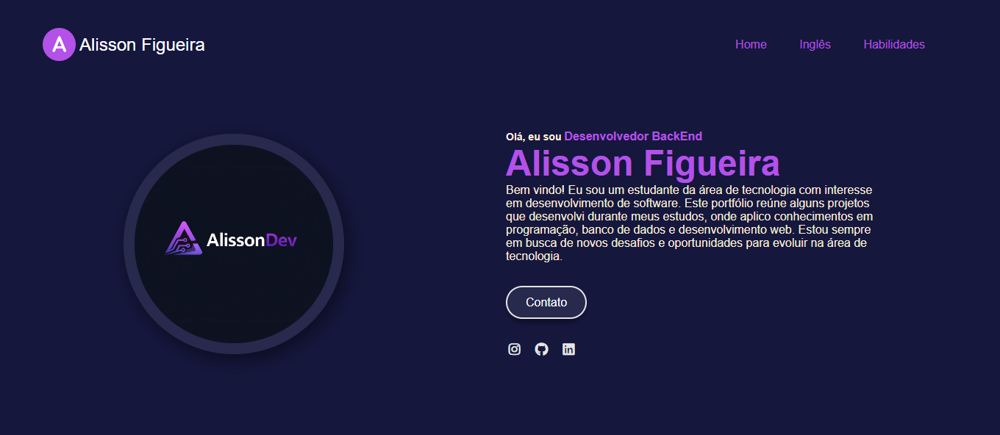
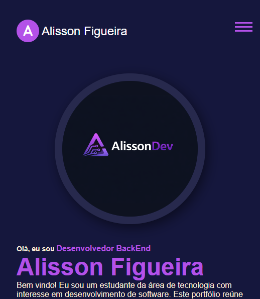

# portifolio_web
## Sobre
Este projeto é um portfólio pessoal desenvolvido com HTML e CSS, com o objetivo de apresentar meus projetos, habilidades e informações profissionais.
## Tecnologias utilizadas
HTML5
CSS3
## Objetivo
Criar uma página pessoal para:
Apresentar meus projetos
Praticar desenvolvimento front-end
Servir como portfólio profissional

## Melhorias futuras
Adicionar JavaScript
Criar animações
Melhorar responsividade
Integrar com projetos reais

# Previews 

    
  

